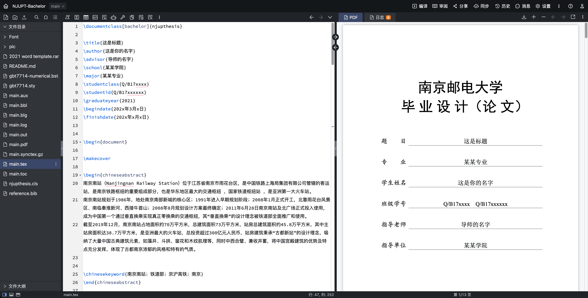

## 南京邮电大学本科毕业设计Latex模板

本项目于2025年2月fork自[dhiyu/NJUPT-Bachelor](https://github.com/dhiyu/NJUPT-Bachelor)。由于源仓库作者似乎已不再维护，本仓库合并了源仓库的问题PR，并针对我使用过程中遇到的一些问题进行了小部分修改，希望能帮到后来者。

fork后的修改点（按提交顺序）：

- 摘要名称修改：中文摘要改为`摘要`，英文摘要改成`ABSTRACT`；
- 新增附录自动ABCD编号：附录可以通过多个`\thesisappendix`自动插入附录A、附录B，修复大纲中附录A中字母A字号较小的问题；
- 新增listings来引入代码块，但是不推荐使用（不确定学校是否允许这种格式）；
- 行距1.25倍：latex中的`\linespread{1.35}`才和docx中的1.25倍行距相似（原本是`\linespread{1.25}`，间隙会变小），**论文封面信息部分依旧保持1.25行距**；
- 封面间距缩小：封面南邮标题和论文信息之间的空隙减小，论文制作时间和论文信息之间的空隙减小；
- 参考文献间距修改：参考文献标题和列表之间新增10pt的空隙（原本无空隙）；
- 2025新模板要求英文摘要中Key和words中间有一个空格（原本是Keywords）；
- 2025新模板要求图表序号与图表描述之间只包含一个全角空格（原始模板是两个）；
- gbt7714-numerical.bst格式文件中show.doi改为0，参考文献中不显示doi编号（学校要求中不需要doi编号，必须去除）；
- 标题间距修改：原始模板中，中文摘要、英文摘要、结束语、致谢与正文部分间隔1cm，过长，目前间距修正为0.6cm；
- 新增`\createdate`作为原创性声明日期；

### 介绍

本模板是《南京邮电大学本科生(理工艺教类)毕业设计》的LaTex模板，该模板由[NJUPThesis-Bachelor](https://github.com/imguozr/NJUPThesis-Bachelor) 以及[lemoxiao](https://github.com/lemoxiao)修改过的[NJUPThesis-Bachelor](https://github.com/lemoxiao/NJUPThesis-Scholar)演化而来，并做了大量的修改工作和完善工作。

慕雪在原作者[dhiyu](https://github.com/dhiyu/NJUPT-Bachelor)的基础上针对2025年本科毕设论文模板的要求做了对应的修正。

### 核心特征

- 使用了GBT-7714标准引用格式，经过我的研究，在我以上提到的模板中，其参考文献格式是最大的问题。经过对教务处给出的Word版本的模板进行研究，我发现其与GBT-7714模板高度一致，有理由认为应该就是GBT-7714。因此在模板中我使用了GBT7714引用格式。
- 修正了封面不在中间的问题
- 修改了页面参数，包括页边距、行距、段间距，页眉、页尾等等，和官方Word保持一致。
- 修改了结束语、致谢、参考文献的标题格式，修改了附录的格式。
- 修复了图注和表标题后面没有空格的问题。
- 修复了公式编号问题。
- 修改了原创性声明的格式，与官方保持一致。
- 其它大量的细节优化和 模板文件(`.cls`)注释添加
- 修改了目录样式，但是请注意没有为四级标题添加匹配（也不符合南邮规范）

### 运行环境

若你对LaTex不熟悉，可以直接使用[overleaf](https://cn.overleaf.com/)或[TexPage](https://www.texpage.com/)（推荐后者）在线编辑。好处是方便，在TexPage网站上注册登录，新建项目时选择“上传项目”，下载本仓库zip上传，上传之后即可在线编辑，如下图所示。

温馨提醒：数据无价，使用在线网站编辑你的毕设时，一定要记得多备份！在TexPage页面右上角三个点处点击就可以直接下载论文PDF和tex源码，一定要定期将tex源码下载到电脑本地备份！数据无价！

如果你更在乎数据安全和稳定性，个人建议在**本地**编辑和编译，避免无网络、网站故障情况下无法编辑论文。

1. 对于 `Windows` 系统，直接安装 `TeX Live` ，编辑器推荐使用`TeXstudio`。
2. `MacOS` 经过 [Leo Y Chen](https://github.com/xsro) 和慕雪的测试，基本无问题，通过 `brew install mactex` 安装mactex环境即可（需要先安装brew）。
3. [Leo Y Chen](https://github.com/xsro)提供了`vscode`的latex编译配置文件，存放在`.vscode/`文件夹中。vscode 需要安装 [LaTeX Workshop](https://marketplace.visualstudio.com/items?itemName=James-Yu.latex-workshop) 插件。安装完毕此插件后，修改`main.tex`并保存，就会自动触发编译流程，更新`main.pdf`。

### 编译过程

带参考文献的中文文档，一般进行以下四次编译：

`XeLaTeX` -> `BibTeX` -> `XeLaTeX` -> `XeLaTeX`

一般来说我们最常用的是`TeXstudio`，在里面的选项->设置->构建中可以自己编写编译链。如果使用vscode，本模板已经做好了LaTeX Workshop插件的编译流程配置，参考上文。

### 论文编写指南

使用本模板编写论文的时候，只需要修改`main.tex`和`reference.bib`两个文件，并将需要插入的图片放入`pic`文件夹中即可。针对这三个需要修改的地方做如下说明：

- `main.tex`: 这是tex源文件，论文全文都是修改这个文件。本仓库已填充了标题、图片、参考文献、附录的示例，可以对照生成的 `main.pdf` 熟悉代码。
- `reference.bib`: 论文的参考文献库。在论文网站复制引用的时候选择bibtex格式，写入reference.bib文件后，正文中使用`\cite{论文}`进行引用，编译时会自动更新参考文献。
- `./pic`: 将图片放入该文件夹，图片支持常规的格式如`eps`, `jpg`, `png` , `pdf`。`pdf`文件可以编译得更快（至少3倍的速度提升），可以通过WPS或者[docsmall](https://docsmall.com/image-to-pdf)批量将图片转为PDF格式。在`main.tex`中只需要`{文件名}`就可以展示图片（不需要图片文件后缀），具体可以参考`main.tex`中已有的图片引用代码。

其余文件**不要修改**，除非你知道它们的作用。

### 字数统计

字数统计可以通过多种方式进行，摘自：[NJUPThesis-Bachelor](https://github.com/imguozr/NJUPThesis-Bachelor)

1. 在命令行中使用 `texcount your-tex-file-name.tex` 命令进行统计。
2. 对生成的 PDF 文件进行统计。
3. 在vscode中[LaTeX Workshop](https://marketplace.visualstudio.com/items?itemName=James-Yu.latex-workshop)插件的`侧边栏-杂项-统计LaTeX文档中的词数`，点击后会在右下角弹窗显示当前文档的词数。

### 已知问题

1. ~~目前来看唯一的缺陷可能是当时编写时比较急促，自身水平又比较差，在一些标题和题注的格式上，为了和官方Word模板几乎相同，我在里面加了一些空格或是间隔，本身是不推荐大家这样修改模板的，会造成在正文文段中引用时也出现空格和间隔~~。目前此问题已由[Leo Y Chen](https://github.com/xsro)解决。暂时无问题，欢迎大家反馈。
2. everypage的功能已经被官方支持所以不再需要这个包，所以这个包会警告，参见[ref](https://stackoverflow.com/questions/64921954/how-to-solve-latex-package-warning-for-everypage)。

### Q&A

由于本人水平所限，如果有问题，欢迎大家提出issue，也欢迎解决后提pull request。

如果觉得好用，你可以在致谢部分留下**本论文采用基于 LaTeX 的南京邮电大学本科论文模版编写**，欢迎附上本GitHub repo的链接。

### 贡献者名单

- [dhiyu](https://github.com/dhiyu) (Owner)
- [Leo Y Chen](https://github.com/xsro) (Contributer)
- [musnows](https://github.com/musnows/) (Contributer)

### 参考项目

- [imguozr/NJUPThesis-Bachelor](https://github.com/imguozr/NJUPThesis-Bachelor)
- [lemoxiao/NJUPThesis-Bachelor](https://github.com/lemoxiao/NJUPThesis-Scholar)
